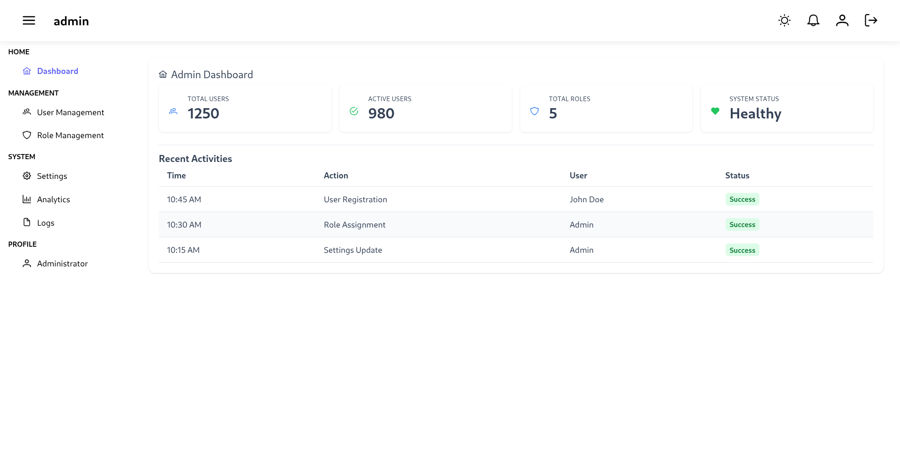
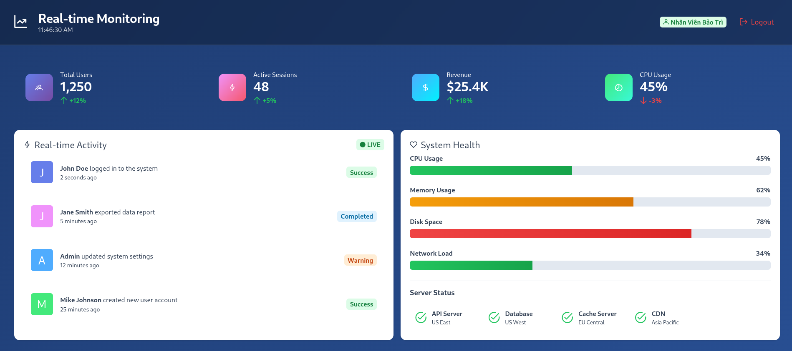
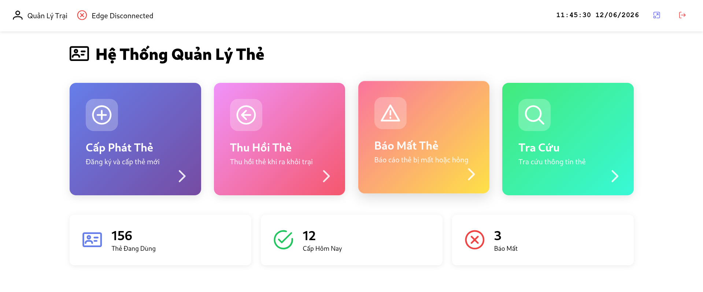
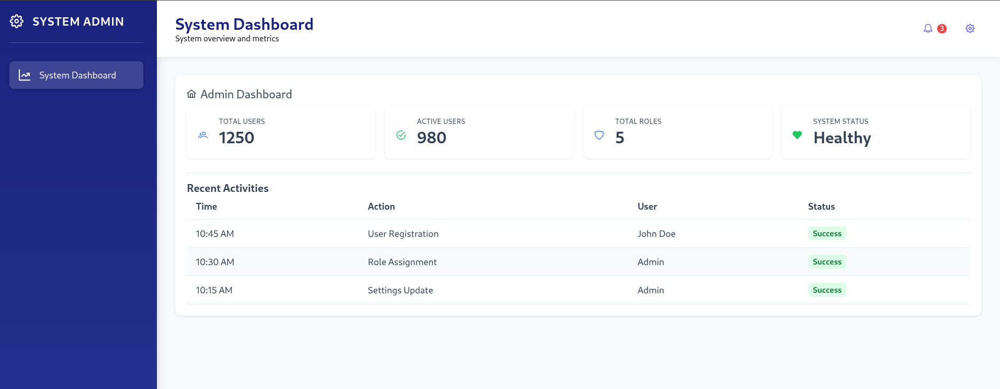

# FastAPI Vue Boilerplate

A professional, full-stack boilerplate with **FastAPI backend**, **Vue 3 frontend**, **PostgreSQL database**, and **RBAC authentication**. The system is designed to serve multiple user personas by delivering different interface layouts and navigation flows based on the authenticated user's role.

This project supports multiple role-specific UI shells, including admin, monitor, kiosk, and user dashboards. Each role sees a different set of routes, menus, and pages, making it ideal for enterprise applications with mixed user types.

## Features

### ✨ Core Features
- ✅ **JWT-based Authentication** - Secure token-based auth with refresh tokens
- ✅ **Role-Based Interface Switching** - Different layouts and dashboards are rendered automatically for each role
- ✅ **Multi-Layout Support** - Separate admin, monitor, kiosk, and user shells with role-aware navigation
- ✅ **RBAC System** - Role-Based Access Control with granular permissions and protected routes
- ✅ **Admin Dashboard** - Full-featured admin interface for user and role management
- ✅ **Monitor Dashboard** - Maintenance and monitoring view for operational staff
- ✅ **Kiosk Interface** - Simplified kiosk mode for security guards and site managers
- ✅ **User Dashboard** - Real-time monitoring screen for regular users
- ✅ **User Management** - Admin can create, update, and manage users
- ✅ **Role Management** - Define roles and assign permissions
- ✅ **Responsive UI** - Mobile-first design with PrimeVue components

### 🧩 Role-Based Interfaces
The app dynamically selects the UI layout and route structure according to the authenticated user's role.
- **SuperAdmin / Admin**: admin layout with user management, role management, and system configuration pages.
- **IT Staff**: system/dashboard layout with monitoring and configuration access.
- **Maintenance (Bảo Trì)**: monitor layout focused on operational health and reports.
- **Security Guard / Site Manager**: kiosk layout with simplified access and task-specific pages.
- **Regular Users**: user dashboard layout with monitoring and personal profile pages.

### 🖼️ Role-Based UI Screenshots
Below are inline previews using the actual screenshot files located in `docs/screenshots/`. These images are shown so readers immediately see the UI for each role; replace them with higher-fidelity screenshots if you have updated captures.

<table>
	<tr>
		<td align="center">
			
			<p><strong>Admin</strong><br/>User & Role Management</p>
		</td>
		<td align="center">
			
			<p><strong>Monitor</strong><br/>System Health & Metrics</p>
		</td>
	</tr>
	<tr>
		<td align="center">
			
			<p><strong>Kiosk</strong><br/>Simplified task UI</p>
		</td>
		<td align="center">
			
			<p><strong>User</strong><br/>Realtime Monitoring</p>
		</td>
	</tr>
</table>

If you prefer SVG placeholders or want to include both formats, update the `src` attributes accordingly. Files are located in `docs/screenshots/`.

### 🎨 Professional Features
- 📊 **Real-time Dashboards** - Live statistics and monitoring
- 🔐 **Password Security** - Bcrypt hashing with salt
- 🛡️ **CORS Protection** - Configurable CORS middleware
- 📝 **Input Validation** - Pydantic schemas for data validation
- 🚀 **Docker Support** - Complete Docker & Docker Compose setup
- 📦 **Database Migrations** - SQLAlchemy ORM with proper models
- 🎬 **Professional Layout** - Reusable admin and auth layouts

### 🔧 Technical Stack

**Backend:**
- FastAPI 0.104+
- SQLAlchemy 2.0
- PostgreSQL 15
- JWT Authentication
- Pydantic

**Frontend:**
- Vue 3 (Composition API)
- Vue Router 4
- Pinia (State Management)
- PrimeVue v4 (UI Components)
- Axios (HTTP Client)
- Vite (Build Tool)

## Quick Start

### Prerequisites
- Python 3.11+
- Node.js 20+
- PostgreSQL 15+
- Docker & Docker Compose (optional)

### 1. Clone & Setup Backend

```bash
cd backend
cp .env.example .env
pip install -r requirements.txt
python -m app.database.init_db  # Initialize database
python main.py
```

Backend will run at `http://localhost:8000`

### 2. Setup Frontend

```bash
cd frontend
npm install
npm run dev
```

Frontend will run at `http://localhost:5173`

### 3. Demo Login Credentials

After initialization, use one of the seeded demo accounts. Each account will open a tailored interface based on its role:
- **SuperAdmin**: `superadmin@example.com` / `super123` — full system access and admin layout
- **Admin**: `admin` / `admin123` — administrative user and management interface
- **IT Staff**: `it@example.com` / `it123` — system and monitoring dashboard
- **Regular User**: `user` / `user123` — user dashboard and monitoring UI

## Docker Setup

```bash
docker-compose up --build
```

All services will start:
- Backend: http://localhost:8000
- Frontend: http://localhost:5173
- PostgreSQL: localhost:5432

## Database Management

Manage your database with Laravel-style commands. See [DATABASE.md](DATABASE.md) for full documentation.

### Quick Commands

```bash
# Check database status
docker exec fastapi_vue_backend python manage.py status

# Fresh install with demo data
docker exec fastapi_vue_backend python manage.py reset

# Just seed data
docker exec fastapi_vue_backend python manage.py seed
```

### Available Commands
- `migrate` - Create all tables
- `seed` - Seed with demo data
- `refresh` - Drop and recreate tables
- `reset` - Drop, recreate, and seed (fresh start)
- `drop` - Drop all tables
- `status` - Show database info

**Demo Users Created:**
- `superadmin` / `super123` (SuperAdmin)
- `admin` / `admin123` (Admin)
- `it_staff` / `it123` (IT Staff)
- `bao_tri_user` / `baotri123` (Maintenance)
- `bao_ve_user` / `baove123` (Security)
- `quan_ly` / `quanly123` (Site Manager)

## Project Structure

```
fastapi-vue-boilerplate/
├── backend/
│   ├── app/
│   │   ├── api/              # API routes
│   │   ├── models/           # SQLAlchemy models
│   │   ├── schemas/          # Pydantic schemas
│   │   ├── services/         # Business logic
│   │   ├── security/         # Auth & JWT
│   │   ├── middleware/       # CORS, etc
│   │   ├── database/         # DB setup
│   │   └── config/           # Configuration
│   ├── main.py              # Entry point
│   ├── requirements.txt
│   ├── .env.example
│   └── Dockerfile
│
├── frontend/
│   ├── src/
│   │   ├── components/       # Reusable components
│   │   ├── views/            # Page views
│   │   ├── layouts/          # Layout templates
│   │   ├── stores/           # Pinia stores
│   │   ├── services/         # API services
│   │   ├── router/           # Vue Router
│   │   └── utils/            # Utilities
│   ├── public/
│   ├── package.json
│   ├── vite.config.js
│   └── index.html
│
└── docker-compose.yml
```

## API Endpoints

### Authentication
- `POST /auth/login` - User login
- `POST /auth/refresh` - Refresh token

### Users
- `GET /users/me` - Get current user
- `PUT /users/me` - Update profile
- `POST /users/change-password` - Change password

### Admin
- `GET /admin/users` - List users
- `POST /admin/users` - Create user
- `DELETE /admin/users/{id}` - Deactivate user
- `GET /admin/roles` - List roles
- `GET /admin/permissions` - List permissions

## Security Best Practices

1. **Environment Variables** - Store secrets in `.env` (never commit)
2. **Password Hashing** - Uses bcrypt with salt
3. **JWT Tokens** - Short-lived access tokens (30 min) + refresh tokens
4. **CORS** - Configured for specific origins
5. **Input Validation** - All inputs validated with Pydantic
6. **SQL Injection Prevention** - Using SQLAlchemy ORM

## Database Schema

Key tables:
- `users` - User accounts with role assignment
- `roles` - RBAC roles (admin, user, etc.)
- `permissions` - Fine-grained permissions
- `role_permissions` - Role-permission mapping

## Frontend Routes

- `/login` - Authentication page
- `/dashboard` - User dashboard (realtime monitoring)
- `/admin/dashboard` - Admin overview
- `/admin/users` - User management
- `/admin/roles` - Role management

## Customization Ideas

### Add Email Notifications
- Password reset via email
- User registration confirmation
- Admin alerts

### Enhanced Logging
- Request/response logging
- Audit trail for admin actions
- Error tracking with Sentry

### Advanced Features
- Two-factor authentication (2FA)
- OAuth2 integration (Google, GitHub)
- API rate limiting
- Webhook support

### UI Enhancements
- Dark mode toggle
- Internationalization (i18n)
- Advanced charts and analytics
- File upload management

## Troubleshooting

### Database Connection Error
```bash
# Check PostgreSQL is running
psql -U user -d fastapi_db -c "SELECT 1"

# Reset database
python -m app.database.init_db
```

### CORS Issues
- Update `CORS_ORIGINS` in backend `.env`
- Frontend must match backend configuration

### Frontend Can't Connect to Backend
- Check backend is running at `http://localhost:8000`
- Update `API_BASE_URL` in `frontend/src/services/api.js`

## Performance Optimization

- Database connection pooling
- JWT caching strategies
- Frontend code splitting
- Asset compression
- CDN ready

## License

MIT

## Support

For issues and questions, create an issue in the repository.

---

**Happy coding! 🎉**
